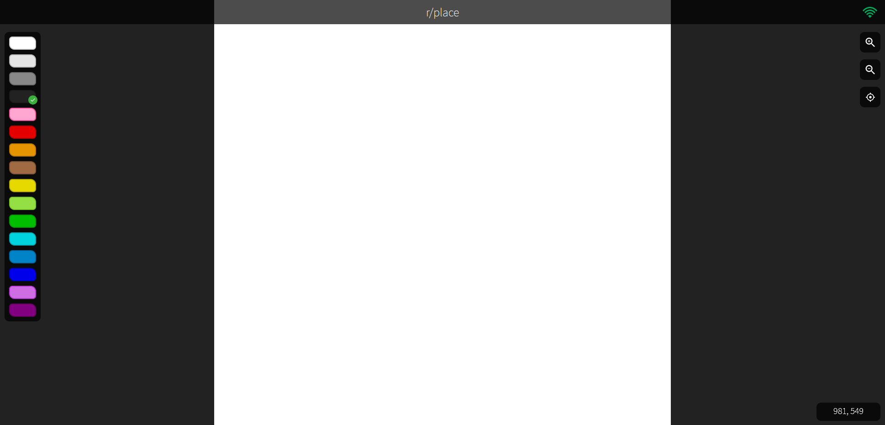

# rplace
A recreation of Reddit's r/place.

## Requirements
- Docker
- Docker Compose

## Building Images with Docker

    $ docker build -t rplace-frontend frontend/
    $ docker build -t rplace-backend backend/

## Deploying Service with Docker Compose

    # Start up containers
    $ docker-compose up -d
    Creating network "rplace_webnet" with the default driver
    Creating rplace_backend_1  ... done
    Creating rplace_cache_1    ... done
    Creating rplace_frontend_1 ... done
    Creating rplace_db_1       ... done

    # Check to see containers are running
    $ docker ps
    CONTAINER ID   IMAGE             COMMAND                  CREATED         STATUS         PORTS                    NAMES
    21017384c517   rplace-backend    "docker-entrypoint.s…"   5 seconds ago   Up 3 seconds   0.0.0.0:80->80/tcp       rplace_backend_1
    89c47650f74f   postgres:alpine   "docker-entrypoint.s…"   5 seconds ago   Up 3 seconds   0.0.0.0:5432->5432/tcp   rplace_db_1
    7c8bbdfefb5c   redis:alpine      "docker-entrypoint.s…"   5 seconds ago   Up 3 seconds   0.0.0.0:6379->6379/tcp   rplace_cache_1
    8ce16d6820ce   rplace-frontend   "docker-entrypoint.s…"   5 seconds ago   Up 3 seconds   0.0.0.0:3000->3000/tcp   rplace_frontend_1

    # Stop all containers
    $ docker-compose down
    Stopping rplace_backend_1  ... done
    Stopping rplace_db_1       ... done
    Stopping rplace_cache_1    ... done
    Stopping rplace_frontend_1 ... done
    Removing rplace_backend_1  ... done
    Removing rplace_db_1       ... done
    Removing rplace_cache_1    ... done
    Removing rplace_frontend_1 ... done
    Removing network rplace_webnet

Navigate to `http://localhost:3000` to view the application.

